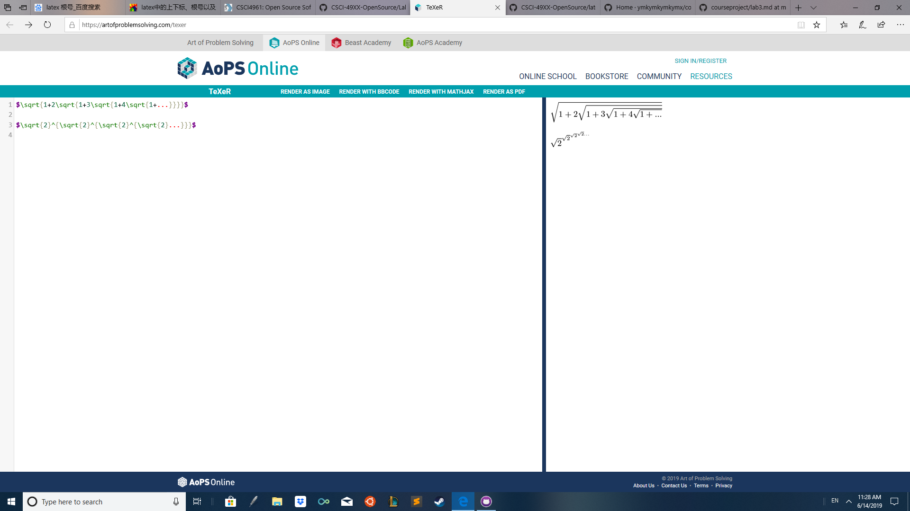
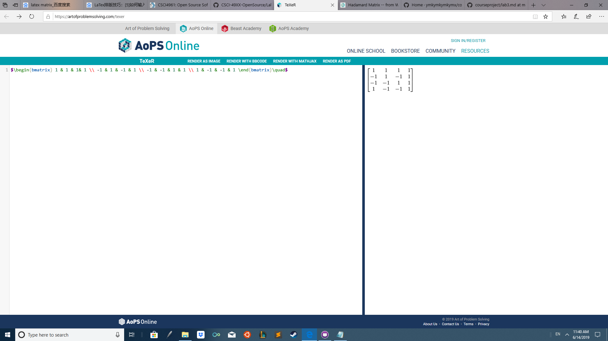

## Part1
#### A link to the wiki page: https://github.com/ymkymkymkymx/courseproject/wiki
#### Step3: 
#### Step4: 

## Part2
### Project name: Open Scanner Serial(OSS) 
* Number of contributors: 2
* Number lines of Codes: 13453+10313+6147=29913
* The first commit: commit 806eab08b5594a6f00e5e4951fb12b34460607a7 at Feb/22/2019 by ashapir0
* The last commit: commit 65780bbbb650f3cd0e0ff5b6b468404380073d7c at Apr/27/2019 by bermaj
* Current branches: master

### youtube link: https://youtu.be/34UavLrnNQo
