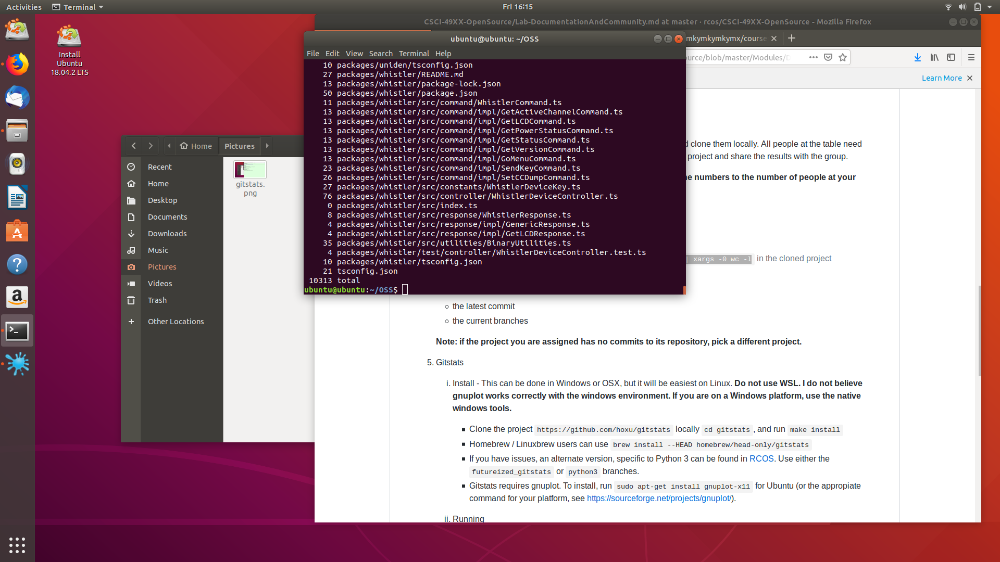
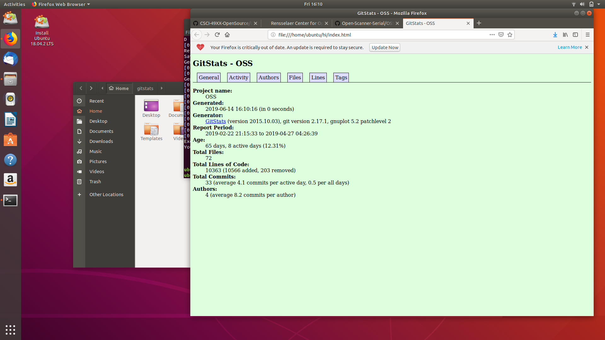
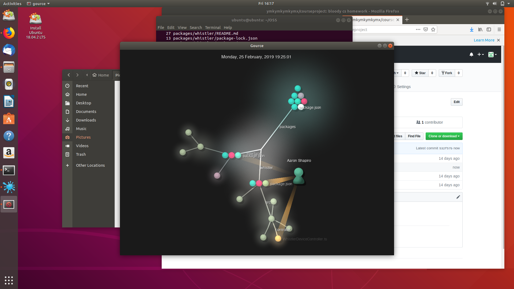
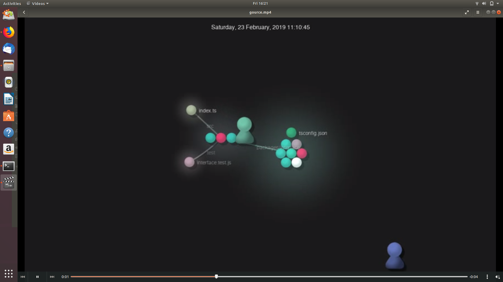

## Part1
#### A link to the wiki page: https://github.com/ymkymkymkymx/courseproject/wiki
#### Step3: 
#### Step4: 

## Part2

## Projects

### Project name: Open Scanner Serial(OSS) 
* Number of contributors: 2
* Number lines of Codes: 13453+10313+6147=29913
* The first commit: commit 806eab08b5594a6f00e5e4951fb12b34460607a7 at Feb/22/2019 by ashapir0
* The last commit: commit 65780bbbb650f3cd0e0ff5b6b468404380073d7c at Apr/27/2019 by bermaj
* Current branches: master

### Project from RCOS: Organizer
* GitHub: https://github.com/V2grad/Organizer
* The number of contributors: 2
* Number of lines of code: 42703 in total
* The first commit: 2018 September 11, Tuesday
* The latest commit: 2019 May 15, Wednesday
* Current branches: dummy, dev, master

### Project from RCOS: Open Source Curriculum
#### Github Page
* Contributors: 4
* 46674 lines of code
* Init commit: a9538d6ab238ded524ffe82854381a87e2e4a085, November 2, 2018
* Latest commit: c6648cc84948d32e81c9b262769ef52c022eb4c4, March 26, 2019
* 1 branch (master)
#### Gitstats Results
* 42921 lines of code
* 33 commits
* 5 authors

### Project from RCOS: Open IO
* number of contributors: 5
* number of lines of code: 246373, 277846
* first commit:
commit 5d6390cf3ddc5eb20f0cc7f7d542c87e1b8c0f42 (HEAD -> master, origin/master, origin/HEAD) 
Merge: 2359f82 3f45f9f 
Author: Adam Gibbons <42285206+gibboa@users.noreply.github.com> 
Date:   Fri Apr 26 13:31:16 2019 -0400 
    Merge pull request #46 from gibboa/zacknawrocki-patch-5
    typo fix
* last commit:
commit ee8777478e0419de1ba3d49b1d9f45836e3207f5 
Merge: a324695 d6eae81 
Author: Adam Gibbons <gibboa@rpi.edu> 
Date:   Fri Apr 26 12:34:48 2019 -0400 
    Merge branch 'master' into zacknawrocki-patch-3
* current branch: master

## Screenshots

### lines analysis by git command:
    

### gitstats: 
#### It is wierd to find that the lines of codes by gitstats is 50 more than git command. Also Authors doubles the contributors, but I found the two more authors were actually the two contributors by their name.
 

### gource: 

  
### vedio of gource: 
    

### youtube link: https://youtu.be/34UavLrnNQo
