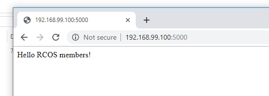

## lab6report
### example 00
#### For example 00, I followed the instruction and got the result as below.
#### 

### example 01
#### For example 01,I followed the instruction and got the result as below.
#### 

### example 02
#### As instructed in class, I skiped the example 02 after I tried it and cannot open the website. However, after following the post on mattermost, I made it.
#### 

### example 03
#### For example 03,I mainly followed the instruction, except that I use the machine IP instead of localhost , and got the result as below.
#### 

### example 04
#### For example 04, I followed the instruction, deleted the node_module file folder(can't pass otherwise), used my machine IP instead of localhost, and got the result as below.
####  

### Reflextion
#### It took me 3 hours to figure out that I should use IP address instead of localhost. It is not that I haven't tried IP address in the first place, but that I had not get both container running and IP address in right format in the same time until I searched the problem on stackoverflow. So in conclusion, stackoverflow is the best.
