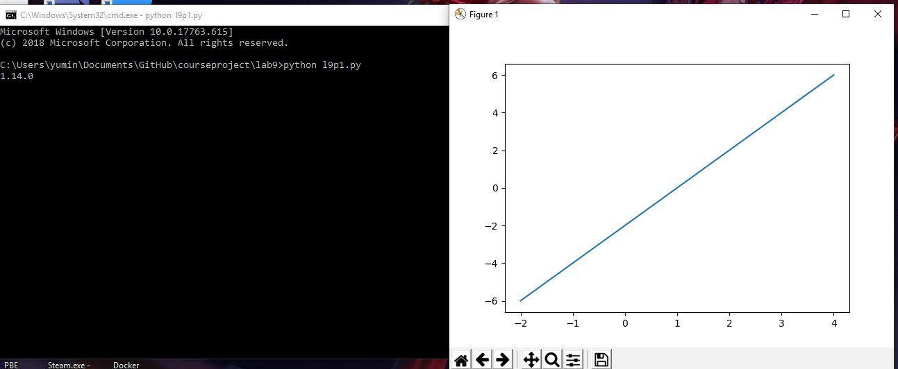
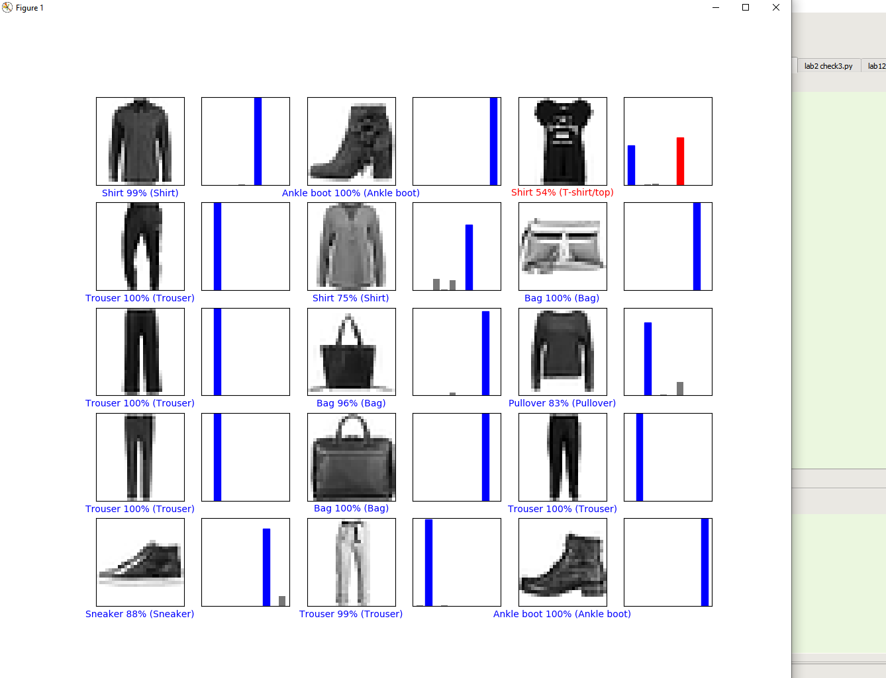
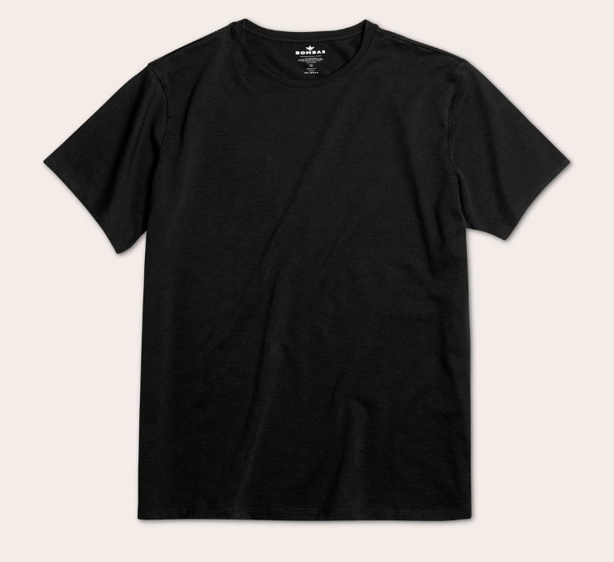
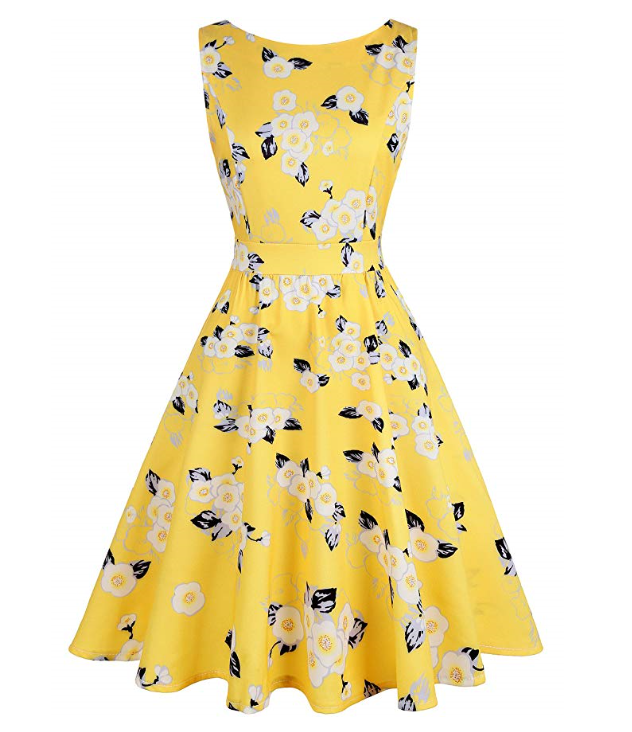
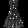
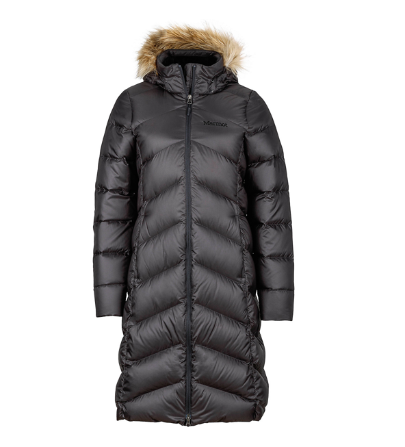

## Lab9 Report

### Part1
#### 

### Part2
#### 

### Part3

#### Shirt:
####   
```
Supposed shirt prediction:
[4.3192810e-01 1.9762522e-06 3.6690466e-04 2.6531596e-04 5.0196244e-04
 3.1990241e-10 5.6258613e-01 7.8258719e-12 4.3495055e-03 2.3141718e-11]

prediction:
Shirt
```
#### Dress:
####   
```
Supposed dress prediction:
[3.65282758e-03 2.61399187e-02 9.48563963e-03 8.14343214e-01
 8.34908243e-03 1.32252235e-05 1.84882246e-03 9.30439637e-06
 1.35935262e-01 2.22677540e-04]

prediction:
Dress
```
#### Coat:
####   
```
Supposed coat prediction:
[1.1528843e-01 1.1544924e-03 8.3783437e-03 1.2497892e-01 6.6801101e-01
 4.4676249e-06 2.4807591e-02 5.4606852e-07 5.7376031e-02 5.7633851e-08]

prediction:
Coat
```